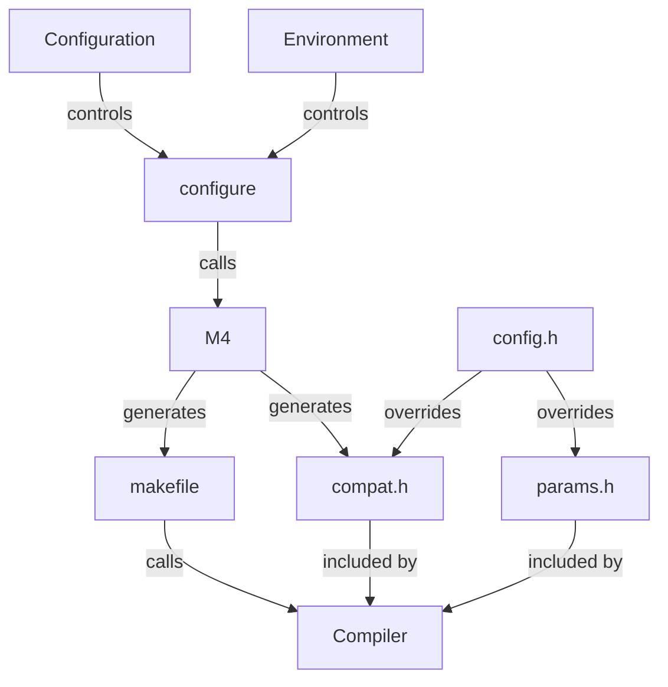

# Building suCGI

## Overview

Configure the build by:

    ./configure

And compile suCGI by:

    make

See below for details.


## Configuration

The build configuration consists of two files: the **makefile**
and **compat.h**, which contains system-specific constants.

Both of these files are generated from M4 templates by `./configure`
(see "Creating a configuration without *configure*" below for an alternative).

*configure* gathers information about your system:

* Which compiler is available?
* Which features does it support?
* Which archiver is available?
* Which are the parameter types of *getgrouplist*() and *setgroups*()?
* Which are the maximum values for user and group ID data types?
* Are **<sys/params.h>** and **<features.h>** available?

It stores that information in a shell script named **config.status**.
You can re-create the **makefile** and **compat.h** using the last
configuration detected by *configure* by running that script.

*configure* is controlled by:

* A configuration file (see the "Configuration files" below")
* Environment variables (see "Variables and macros" below)
* Command line arguments (see `./configure -h`)

SuCGI does *not* use [Autoconf]; *configure* and its configuration files
are hand-written shell scripts. So you can debug them and the **makefile**
if you need to. However, be careful to edit the **makefile**'s M4 template,
**makefile.m4**, *not* the **makefile** itself; the **makefile** may get
overwritten when you call *make*.

You can also override any setting in **[compat.h]** or **[params.h]**
by defining a macro of the same name in **[config.h]**.

[Autoconf]: https://www.gnu.org/software/autoconf


## Configuration files

SuCGI ships with four build configurations;
they can be found in the "conf" sub-directory.

| Filename         | Purpose     |
| ---------------- | ----------- |
| **[prod.env]**   | Production  |
| **[devel.env]**  | Development |
| **[posix.env]**  | Fallback    |
| **[unsafe.env]** | Testing     |

You should use **[prod.env]** for production and **[devel.env]**
for development.

**[posix.env]** disables GNU extensions to C99 and only uses compiler
features that are required by POSIX.1-2008. It can be used as a fallback
if other configurations do not work.

**[unsafe.env]** requests possibly unsafe optimisations and disables
safety checks. It is intended for testing only.

[prod.env]: ../conf/prod.env
[devel.env]: ../conf/devel.env
[posix.env]: ../conf/posix.env
[unsafe.env]: ../conf/unsafe.env


## Configuration variables

*configure*, M4, the **makefile**, and suCGI itself are configured using
environment variables and M4, Make, or C preprocessor macros respectively.



Setting environment variables or changing configuration files changes
the values used to generate the **makefile** and **compat.h**. Defining
Make or C preprocessor macros will override the values in those files.

M4 macros are used by *configure*. They need, and can, only be defined
if the **makefile** and **compat.h** are created without *configure*
(see "Creating a configuration without *configure*" below).

### C compiler (path)

| Tool        | Variable/macro name |
| ----------- | ------------------- |
| *configure* | CC                  |
| M4          | __CC                |
| Make        | CC                  |
| C compiler  | -                   |

Set the default compiler when generating the **makefile** with *configure*:

    CC=/usr/local/bin/obscurecc ./configure

Set the default compiler when generating the **makefile** with M4:

    m4 -D__CC=/usr/local/bin/obscurecc makefile.m4 >makefile

Use a non-default compiler when compiling:

    make CC=/usr/local/bin/obscurecc

### Compiler flags (space-separated list of options)

| Tool        | Variable/macro name |
| ----------- | ------------------- |
| *configure* | CFLAGS              |
| M4          | __CFLAGS            |
| Make        | CFLAGS              |
| C compiler  | -                   |


Add flags to test for or macros with *configure*:

    ./configure -F-fstack-protector-all -DNDEBUG

Set the default compiler flags in the **makefile** with *configure*:

    CFLAGS="-DNDEBUG -O2" ./configure

Set the default compiler flags when generating the **makefile** with M4:

    m4 -D"__CFLAGS=-DNDEBUG -O2" makefile.m4 >makefile

Use non-default flags when compiling:

    make CFLAGS="-DNDEBUG -O2"

### Archiver (path)

| Tool        | Variable/macro name |
| ----------- | ------------------- |
| *configure* | AR                  |
| M4          | __AR                |
| Make        | AR                  |
| C compiler  | -                   |

### Archiver flags (space-separated list of options)

| Tool        | Variable/macro name |
| ----------- | ------------------- |
| *configure* | ARFLAGS             |
| M4          | __ARFLAGS           |
| Make        | ARFLAGS             |
| C compiler  | -                   |

### Linker flags (space-separated list of options)

| Tool        | Variable/macro name |
| ----------- | ------------------- |
| *configure* | LDFLAGS             |
| M4          | __LDFLAGS           |
| Make        | LDFLAGS             |
| C compiler  | -                   |

### Libraries (space-separated list of options)

| Tool        | Variable/macro name |
| ----------- | ------------------- |
| *configure* | LDLIBS              |
| M4          | __LDLIBS            |
| Make        | LDLIBS              |
| C compiler  | -                   |

### Compiler flag for compiling shared objects (string)

| Tool        | Variable/macro name |
| ----------- | ------------------- |
| *configure* | SUCGI_SHARED        |
| M4          | __SUCGI_SHARED      |
| Make        | -                   |
| C compiler  | -                   |

Set to the empty string if the compiler does not support shared objects.

### *getgrouplist*() group ID type (C data type)

| Tool        | Variable/macro name |
| ----------- | ------------------- |
| *configure* | SUCGI_GRP_T         |
| M4          | __SUCGI_GRP_T       |
| Make        | -                   |
| C compiler  | GRP_T               |

GRP_T names the data type that *getgrouplist*() takes and returns GIDs as.
On older systems and macOS this is **int**, on modern systems **gid_t**.

### *setgroups*() number type (C data type)

| Tool        | Variable/macro name |
| ----------- | ------------------- |
| *configure* | SUCGI_NGRPS_T       |
| M4          | __SUCGI_NGRPS_T     |
| Make        | -                   |
| C compiler  | NGRPS_T             |

NGRPS_T names the data type of *setgroups*() third argument, the number of
groups given. On GNU-like systems this is **size_t**, on others **int**.

### **uid_t** maximum (integer)

| Tool        | Variable/macro name |
| ----------- | ------------------- |
| *configure* | SUCGI_MAX_UID_VAL   |
| M4          | __SUCGI_MAX_UID_VAL |
| Make        | -                   |
| C compiler  | MAX_UID_VAL         |

### **gid_t** maximum (integer)

| Tool        | Variable/macro name |
| ----------- | ------------------- |
| *configure* | SUCGI_MAX_GID_VAL   |
| M4          | __SUCGI_MAX_GID_VAL |
| Make        | -                   |
| C compiler  | MAX_GID_VAL         |

### GRP_T maximum (integer)

| Tool        | Variable/macro name |
| ----------- | ------------------- |
| *configure* | SUCGI_MAX_GRP_VAL   |
| M4          | __SUCGI_MAX_GRP_VAL |
| Make        | -                   |
| C compiler  | MAX_GRP_VAL         |

### NGRPS_T maximum (integer)

| Tool        | Variable/macro name   |
| ----------- | --------------------- |
| *configure* | SUCGI_MAX_NGRPS_VAL   |
| M4          | __SUCGI_MAX_NGRPS_VAL |
| Make        | -                     |
| C compiler  | MAX_NGRPS_VAL         |

### **<sys/params.h>** available? (integer)

| Tool        | Variable/macro name       |
| ----------- | ------------------------- |
| *configure* | SUCGI_HAVE_SYS_PARAMS_H   |
| M4          | __SUCGI_HAVE_SYS_PARAMS_H |
| Make        | -                         |
| C compiler  | HAVE_SYS_PARAMS_H         |

Any non-zero integer value means true.

### **<features.h>** available? (integer)

| Tool        | Variable/macro name     |
| ----------- | ----------------------- |
| *configure* | SUCGI_HAVE_FEATURES_H   |
| M4          | __SUCGI_HAVE_FEATURES_H |
| Make        | -                       |
| C compiler  | HAVE_FEATURES_H         |

Any non-zero integer value means true.

### Disable assertions? (integer)

| Tool        | Variable/macro name     |
| ----------- | ----------------------- |
| *configure* | -                       |
| M4          | -                       |
| Make        | -                       |
| C compiler  | NDEBUG                  |

Any non-zero integer value means true.

### Disable attributes? (integer)

| Tool        | Variable/macro name     |
| ----------- | ----------------------- |
| *configure* | -                       |
| M4          | -                       |
| Make        | -                       |
| C compiler  | NATTR                   |

Any non-zero integer value means true.

### Build for testing? (integer)

| Tool        | Variable/macro name     |
| ----------- | ----------------------- |
| *configure* | -                       |
| M4          | -                       |
| Make        | -                       |
| C compiler  | TESTING                 |

Any non-zero integer value means true.

**Test builds are insecure!**


### Installation variables

See [install.md].


### Run-time configuration

SuCGI's run-time behaviour is configured at compile-time.
See **[config.h]** for details. Defaults are set in **[params.h]**.

You can override any macro in **[compat.h]** and **[params.h]** by
using *configure*'s **-D** option or by defining a macro of the same
name in **config.h**.

[compat.h]: ../compat.h
[config.h]: ../config.h
[params.h]: ../params.h


## Creating a configuration without *configure*

If you are running a BSD-, illumos-, or Linux-based or a Minix system on
an architecture that does not pad integer types (e.g., AMD64, x86, ARM64,
or ARM), then you can probably generate a working, albeit suboptimal,
build configuration without *configure* by:

    m4 makefile.m4 >makefile
    m4 compat.h.m4 >compat.h

The resulting build configuration is equivalent to the configuration
defined in **[posix.env]** (see "Default build configurations" above).


## Makefile targets

The **makefile** supports the following 'phony' targets:

| Target    | Description                                           |
| --------- | ----------------------------------------------------- |
| all       | Alias for "sucgi" and the default target.             |
| check     | Compile and run tests (see [testing.md]).             |
| tidy      | Delete archives, backups, logs, temporary files, etc. |
| clean     | Delete compiled binaries and `make tidy`.             |
| mrproper  | Delete caches, coverage data, and `make clean`.       |
| dist      | Make a distribution tarball.                          |
| distcheck | Run `make check` from a distribution tarball.         |
| distclean | Delete the build configuration and `make mrproper`.   |
| sigdist   | Make a signed distribution tarball.                   |
| install   | Install suCGI (see [install.md]).                     |
| uninstall | Uninstall suCGI (see [uninstall.md]).                 |


## Troubleshooting

### "size of unnamed array is negative", "array size is negative", etc.

When a condition that suCGI takes for granted turns out to be false
at compile-time, suCGI's *ASSERT*() macro expands to an expression
that declares an array with a negative size, triggering an error
and aborting the compilation.

This indicates that the build configuration is wrong;
the error message should indicate which setting.

For example, the error

```
main.c: In function 'main':
macros.h:28:41: error: size of unnamed array is negative
   28 | #define ASSERT(cond) ((void) sizeof(char[(cond) ? 1 : -1]))
      |                                         ^
main.c:278:5: note: in expansion of macro 'ASSERT'
  278 |     ASSERT(sizeof(USER_DIR) > 1U);
      |     ^~~~~~
```

indicates that the configuration macro USER_DIR expands to a string
that is shorter than two bytes, that is, either not null-terminated
or the empty string.


[install.md]: install.md
[testing.md]: testing.md
[uninstall.md]: uninstall.md
