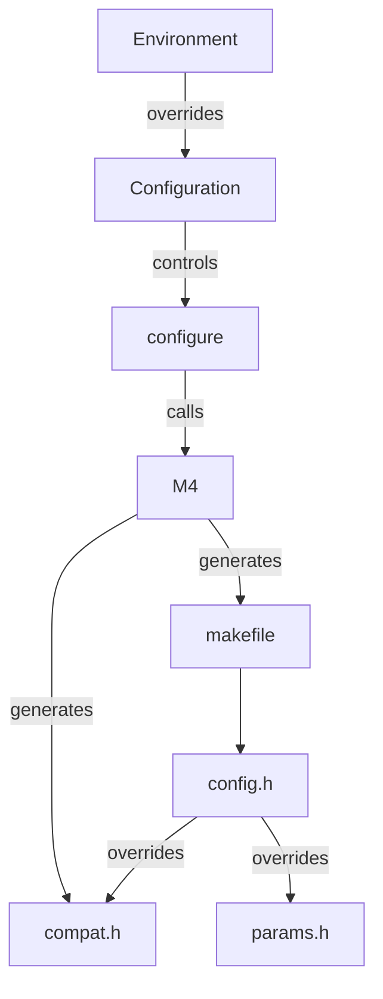

# Building suCGI

## Overview

If you need to, install a C build toolchain by:

    sudo ./installc

Configure the build by:

    ./configure

And compile suCGI by:

    make

See below for details.

## Configuration

The build configuration consists of two files: the **makefile**
and **compat.h**, which contains system-specific constants.

Both files are generated from M4 templates by `./configure`
(see also "Creating a configuration without *configure*").

*configure* gathers information about your system and stores that information
in a shell script named **config.status**; running that script re-creates the
**makefile** and **compat.h** using the last configuration detected.

*configure* is controlled by:

* A configuration file (see "Configuration files" below)
* Environment variables (see "Variables and macros" below)
* Command line arguments (see `./configure -h`)

suCGI does *not* use [Autoconf]; *configure* and its configuration files
are hand-written shell scripts; so you can debug them if you need to.

The same goes for the **makefile**. However, be careful to edit the
**makefile**'s M4 template, **makefile.m4**, *not* the **makefile** itself;
the **makefile** may get overwritten when you call *make*.

You can override any macro in **[compat.h]** or **[params.h]**
by defining a macro of the same name in **[config.h]**.

[Autoconf]: https://www.gnu.org/software/autoconf

## Configuration files

suCGI ships with four build configurations;
they can be found in the "conf" sub-directory.

| Filename         | Purpose     |
| ---------------- | ----------- |
| **[prod.env]**   | Production  |
| **[devel.env]**  | Development |
| **[posix.env]**  | Fallback    |
| **[unsafe.env]** | Testing     |

Use **[prod.env]** for production and **[devel.env]** for development.

**[posix.env]** disables GNU extensions to C99 and only uses compiler
features that are required by POSIX.1-2008. It is intended as a fallback
if **[prod.env]** or **[devel.env]** do not work.

**[unsafe.env]** requests possibly unsafe optimisations and disables
all safety checks. It is intended for testing only.

[prod.env]: ../conf/prod.env
[devel.env]: ../conf/devel.env
[posix.env]: ../conf/posix.env
[unsafe.env]: ../conf/unsafe.env

## Configuration variables

*configure*, M4, the **makefile**, and suCGI itself are configured using
environment variables and M4, Make, or C preprocessor macros respectively.

Setting environment variables or changing configuration files changes
the values that are used to generate the **makefile** and **compat.h**.
Defining Make or Preprocessor macros on the command line will override
the values in those files.

M4 macros are used by *configure*. They only need to, and only can,
be given on the command line if the **makefile** and **compat.h** are
created by calling M4 directly, rather than via  *configure*
(see "Creating a configuration without *configure*" below).

### Compiler (path)

| Tool         | Variable/macro name      |
| ------------ | ------------------------ |
| *configure*  | CC                       |
| M4           | __CC                     |
| Make         | CC                       |
| Preprocessor | -                        |

Set the default compiler when generating the **makefile** with *configure*:

    CC=/usr/local/bin/obscurecc ./configure

Set the default compiler when generating the **makefile** with M4:

    m4 -D__CC=/usr/local/bin/obscurecc makefile.m4 >makefile

Use a non-default compiler when compiling:

    make CC=/usr/local/bin/obscurecc

### Compiler flags (space-separated list of flags)

| Tool         | Variable/macro name      |
| ------------ | ------------------------ |
| *configure*  | CFLAGS                   |
| M4           | __CFLAGS                 |
| Make         | CFLAGS                   |
| Preprocessor | -                        |

Add flags to test for or macros with *configure*:

    ./configure -F-fstack-protector-all -DNDEBUG

Set the default compiler flags in the **makefile** with *configure*:

    CFLAGS="-DNDEBUG -O2" ./configure

Set the default compiler flags when generating the **makefile** with M4:

    m4 -D"__CFLAGS=-DNDEBUG -O2" makefile.m4 >makefile

Use non-default flags when compiling:

    make CFLAGS="-DNDEBUG -O2"

### Archiver (path)

| Tool         | Variable/macro name      |
| ------------ | ------------------------ |
| *configure*  | AR                       |
| M4           | __AR                     |
| Make         | AR                       |
| Preprocessor | -                        |

### Archiver flags (space-separated list of flags)

| Tool         | Variable/macro name      |
| ------------ | ------------------------ |
| *configure*  | ARFLAGS                  |
| M4           | __ARFLAGS                |
| Make         | ARFLAGS                  |
| Preprocessor | -                        |

### Linker flags (space-separated list of flags)

| Tool         | Variable/macro name      |
| ------------ | ------------------------ |
| *configure*  | LDFLAGS                  |
| M4           | __LDFLAGS                |
| Make         | LDFLAGS                  |
| Preprocessor | -                        |

### Libraries (space-separated list of flags)

| Tool         | Variable/macro name      |
| ------------ | ------------------------ |
| *configure*  | LDLIBS                   |
| M4           | __LDLIBS                 |
| Make         | LDLIBS                   |
| Preprocessor | -                        |

### Compiler flags for position-independent code (space-separated list of flags)

| Tool         | Variable/macro name      |
| ------------ | ------------------------ |
| *configure*  | SUCGI_PIC                |
| M4           | __PIC                    |
| Make         | pic                      |
| Preprocessor | -                        |

Set to the empty string if the compiler does not support
position-independent code.

### Compiler flags for position-independent executables (space-separated list of flags)

| Tool         | Variable/macro name      |
| ------------ | ------------------------ |
| *configure*  | SUCGI_PIE                |
| M4           | __PIE                    |
| Make         | pie                      |
| Preprocessor | -                        |

Set to the empty string if the compiler does not support
position-independent executables.

### Compiler flags for compiling shared objects (string)

| Tool         | Variable/macro name      |
| ------------ | ------------------------ |
| *configure*  | SUCGI_SHARED             |
| M4           | __SHARED                 |
| Make         | -                        |
| Preprocessor | -                        |

Set to the empty string if the compiler does not support shared objects.
Should only be set if __PIC is set, too.

### *getgrouplist*() group ID type (C data type)

| Tool         | Variable/macro name      |
| ------------ | ------------------------ |
| *configure*  | SUCGI_GRP_T              |
| M4           | __GRP_T                  |
| Make         | -                        |
| Preprocessor | GRP_T                    |

GRP_T names the data type that *getgrouplist*() takes and returns GIDs as.
On older systems and macOS this is **int**, on modern systems **gid_t**.

### *setgroups*() number type (C data type)

| Tool         | Variable/macro name      |
| ------------ | ------------------------ |
| *configure*  | SUCGI_NGRPS_T            |
| M4           | __NGRPS_T                |
| Make         | -                        |
| Preprocessor | NGRPS_T                  |

NGRPS_T names the data type of *setgroups*() third argument, the number
of groups given. On GNU and GNU-like systems this is **size_t**, on other
systems **int**.

### **uid_t** maximum (integer)

| Tool         | Variable/macro name      |
| ------------ | ------------------------ |
| *configure*  | SUCGI_MAX_UID_VAL        |
| M4           | __MAX_UID_VAL            |
| Make         | -                        |
| Preprocessor | MAX_UID_VAL              |

### **gid_t** maximum (integer)

| Tool         | Variable/macro name      |
| ------------ | ------------------------ |
| *configure*  | SUCGI_MAX_GID_VAL        |
| M4           | __MAX_GID_VAL            |
| Make         | -                        |
| Preprocessor | MAX_GID_VAL              |

### GRP_T maximum (integer)

| Tool         | Variable/macro name      |
| ------------ | ------------------------ |
| *configure*  | SUCGI_MAX_GRP_VAL        |
| M4           | __MAX_GRP_VAL            |
| Make         | -                        |
| Preprocessor | MAX_GRP_VAL              |

### NGRPS_T maximum (integer)

| Tool         | Variable/macro name      |
| ------------ | ------------------------ |
| *configure*  | SUCGI_MAX_NGRPS_VAL      |
| M4           | __MAX_NGRPS_VAL          |
| Make         | -                        |
| Preprocessor | MAX_NGRPS_VAL            |

### **<sys/params.h>** available? (integer)

| Tool         | Variable/macro name      |
| ------------ | ------------------------ |
| *configure*  | SUCGI_HAVE_SYS_PARAMS_H  |
| M4           | __HAVE_SYS_PARAMS_H      |
| Make         | -                        |
| Preprocessor | HAVE_SYS_PARAMS_H        |

Any non-zero integer value means true.

### **<features.h>** available? (integer)

| Tool         | Variable/macro name      |
| ------------ | ------------------------ |
| *configure*  | SUCGI_HAVE_FEATURES_H    |
| M4           | __HAVE_FEATURES_H        |
| Make         | -                        |
| Preprocessor | HAVE_FEATURES_H          |

Any non-zero integer value means true.

### Disable assertions? (integer)

| Tool         | Variable/macro name      |
| ------------ | ------------------------ |
| *configure*  | -                        |
| M4           | -                        |
| Make         | -                        |
| Preprocessor | NDEBUG                   |

Any non-zero integer value means true.

### Disable attributes? (integer)

| Tool         | Variable/macro name      |
| ------------ | ------------------------ |
| *configure*  | -                        |
| M4           | -                        |
| Make         | -                        |
| Preprocessor | NATTR                    |

Any non-zero integer value means true.

### Build for testing? (integer)

> [!WARNING]
> Test builds are insecure!

| Tool         | Variable/macro name      |
| ------------ | ------------------------ |
| *configure*  | -                        |
| M4           | -                        |
| Make         | -                        |
| Preprocessor | TESTING                  |

Any non-zero integer value means true.

### Installation variables

See [install.md].

### Run-time configuration

suCGI's run-time behaviour is configured at compile-time.
See **[config.h]** for details. Defaults are set in **[params.h]**.

Any macro in **[compat.h]** and **[params.h]** can be overridden by
using *configure*'s **-D** option or by defining a macro of the same
name in **config.h**.

[compat.h]: ../compat.h
[config.h]: ../config.h
[params.h]: ../params.h

## Creating a configuration without *configure*

If *configure* fails, a fallback build configuration can be created by:

    m4 makefile.m4 >makefile

The resulting build configuration is roughly equivalent to **[posix.env]**
(see "Default build configurations" above).

> [!WARNING]
> This build configuration is only known to be safe on architectures with
> unpadded integer types (e.g., x86, x86-64, ARM, ARM64) and when running
> either DragonflyBSD, FreeBSD, GNU/Linux, GNU Hurd, Minix, musl/Linux,
> uClibc/Linux, NetBSD, or OpenBSD.

## Makefile targets

The **makefile** supports the following 'phony' targets:

| Target    | Description                                           |
| --------- | ----------------------------------------------------- |
| all       | Alias for "sucgi" and the default target.             |
| check     | Compile and run tests (see [testing.md]).             |
| tidy      | Delete archives, backups, logs, temporary files, etc. |
| clean     | Delete compiled binaries and `make tidy`.             |
| mrproper  | Delete caches, coverage data, and `make clean`.       |
| dist      | Make a distribution tarball.                          |
| distcheck | Run `make check` from a distribution tarball.         |
| distclean | Delete the build configuration and `make mrproper`.   |
| sigdist   | Make a signed distribution tarball.                   |
| install   | Install suCGI (see [install.md]).                     |
| uninstall | Uninstall suCGI (see [uninstall.md]).                 |

## Troubleshooting

### Raising the number of groups suCGI can handle

If the number of groups that a user is a member of exceeds the value of
the macro MAX_NGROUPS (see above), then CGI scripts of that user will only
be run with the permissions of an arbitrary subset of those groups.

The default limit can be changed by either setting a higher limit
in **config.h** or by using *configure*'s **-D** flag:

    $ ./configure -DMAX_NGROUPS=65536
    [...]
    $ make
    [...]
    $ ./sucgi -C | grep -E ^MAX_NGROUPS=
    65536

### "size of unnamed array is negative", "array size is negative", etc.

There is an error in the build configuration.

The message should indicate which setting is wrong.
For example,

    main.c: In function 'main':
    macros.h:28:41: error: size of unnamed array is negative
       28 | #define ASSERT(cond) ((void) sizeof(char[(cond) ? 1 : -1]))
          |                                         ^
    main.c:278:5: note: in expansion of macro 'ASSERT'
      278 |     ASSERT(sizeof(USER_DIR) > 1U);
          |     ^~~~~~

indicates that the macro USER_DIR expands to a string that is too short.

### Object files are recompiled even if the source did not change

Try using another archiver. *ar* is good enough on most systems:

    AR=ar ./configure

[install.md]: install.md
[testing.md]: testing.md
[uninstall.md]: uninstall.md
