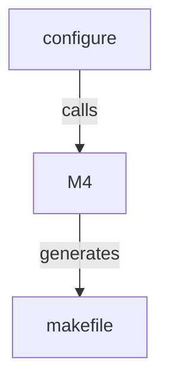

# Installing suCGI

## Installation

Once you have [compiled](building.md) suCGI, install it with

    sudo make install

Note, `make install` will only copy files that are newer than their target.

## Configuration variables

*configure*, M4, and the **makefile** are configured using environment
variables and M4 or Make macros respectively.

> [!WARNING]
> If you change the **makefile**'s defaults by defining Make macros on the
> command line when you install suCGI, you *must* define the same macros
> with the same values when you call `make uninstall`!

> [!WARNING]
> Filenames must *not* contain whitespace or shell meta characters.

M4 macros are used by *configure*. They only need to, and only can,
be given on the command line if the **makefile** and **compat.h** are
created by calling M4 directly, rather than via  *configure*
(see "Creating a configuration without *configure*" in [build.md]).

### Directory prefix (filename)

| Tool        | Variable/macro name |
| ----------- | ------------------- |
| *configure* | PREFIX              |
| M4          | __PREFIX            |
| Make        | prefix              |

Defaults to **/usr/local**.

`make install` copies the suCGI binary to **$DESTDIR$PREFIX/libexec/sucgi**.

Set the default prefix in the **makefile** using *configure*:

    ./configure PREFIX=/usr

Set the default prefix when generating the **makefile** with M4:

    m4 -D__PREFIX=/usr makefile.in >makefile

Use a non-default prefix when installing:

    make prefix=/usr install

### Destination directory (filename)

| Tool        | Variable/macro name |
| ----------- | ------------------- |
| *configure* | DESTDIR             |
| M4          | __DESTDIR           |
| Make        | DESTDIR             |

Defaults to the empty string.

`make install` copies the suCGI binary to **$DESTDIR$PREFIX/libexec/sucgi**.

### **/cgi-bin** directory (filename)

| Tool        | Variable/macro name |
| ----------- | ------------------- |
| *configure* | cgidir              |
| M4          | __cgidir            |
| Make        | cgidir              |

`make install` symlinks the suCGI binary into this directory.

Defaults to **$DESTDIR/usr/lib/cgi-bin**.

### Group the webserver runs as (group name)

| Tool        | Variable/macro name |
| ----------- | ------------------- |
| *configure* | wwwgrp              |
| M4          | __wwwgrp            |
| Make        | wwwgrp              |

`make install` changes the group of the suCGI binary to this group.

Defaults to "www-data".

### Other installation variables

See <https://www.gnu.org/prep/standards/html_node/Makefile-Conventions.html>.

### Build and run-time configuration

See [build.md].

[build.md]: build.md
