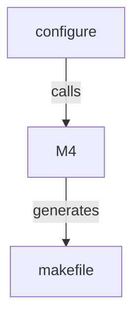

# Installing suCGI

## Installation

Once you have [compiled](building.md) suCGI, install it with

    make install

`make install` will only copy suCGI if the compiled binary
is more recent than the installation target.

## Configuration variables

*configure*, M4, and the **makefile** are configured using environment
variables and M4, or Make respectively.

If you change the **makefile**'s defaults by defining Make macros on the
command line when you install suCGI, you *must* define the same macros with
the same values when you call `make uninstall`!

M4 macros are used by *configure*. They need, and can, only be defined
if the **makefile** and **compat.h** are created without *configure*
(see "Creating a configuration without *configure*" in [build.md]).

### Directory prefix (path)

| Tool        | Variable/macro name |
| ----------- | ------------------- |
| *configure* | PREFIX              |
| M4          | __PREFIX            |
| Make        | -                   |
| C compiler  | -                   |

Defaults to **/usr/local**.

`make install` copies the suCGI binary to `$DESTDIR$PREFIX/libexec/sucgi`.

Set the default prefix in the **makefile** using *configure*:

    PREFIX=/usr ./configure

Set the default prefix when generating the **makefile** with M4:

    m4 -D__PREFIX=/usr makefile.m4 >makefile

Use a non-default prefix when installing:

    make PREFIX=/usr install

### Destination directory (path)

| Tool        | Variable/macro name |
| ----------- | ------------------- |
| *configure* | DESTDIR             |
| M4          | __DESTDIR           |
| Make        | -                   |
| C compiler  | -                   |

Defaults to the empty string.

`make install` copies the suCGI binary to `$DESTDIR$PREFIX/libexec/sucgi`.

### **/cgi-bin** directory (path)

| Tool        | Variable/macro name |
| ----------- | ------------------- |
| *configure* | SUCGI_CGI_DIR       |
| M4          | __SUCGI_CGI_DIR     |
| Make        | cgi_dir             |
| C compiler  | -                   |

`make install` links the suCGI binary into this directory.

Defaults to **/usr/lib/cgi-bin**.

### Group the webserver runs as (group name)

| Tool        | Variable/macro name |
| ----------- | ------------------- |
| *configure* | SUCGI_WWW_GRP       |
| M4          | __SUCGI_WWW_GRP     |
| Make        | www_grp             |
| C compiler  | -                   |

`make install` changes the group of the suCGI binary to this group.

Defaults to "www-data".

### Build and run-time configuration

See [build.md].

[build.md]: build.md
